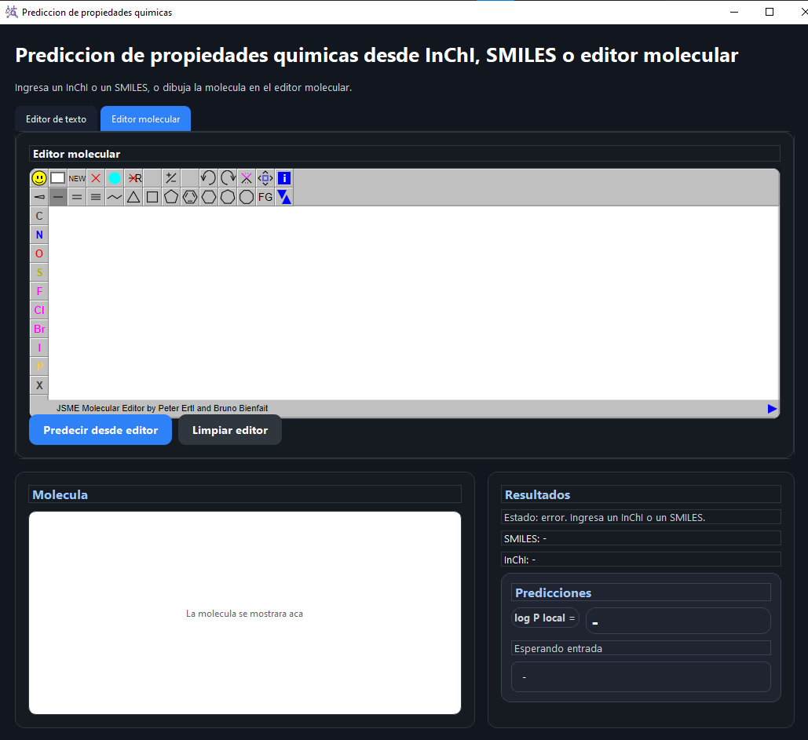
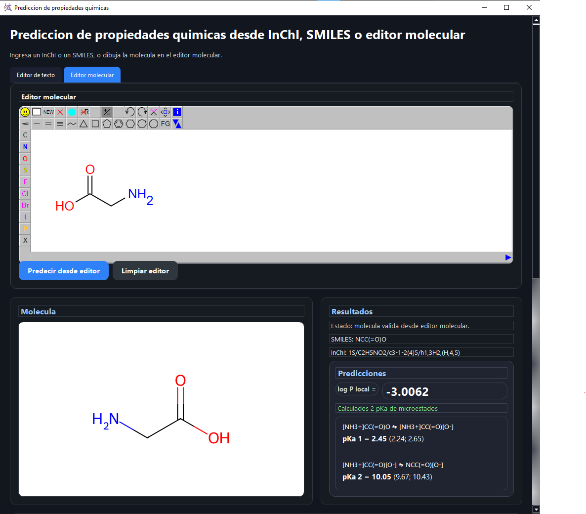
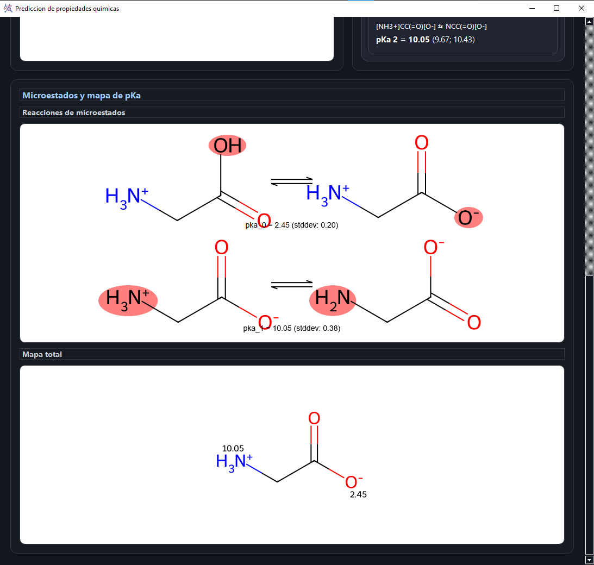
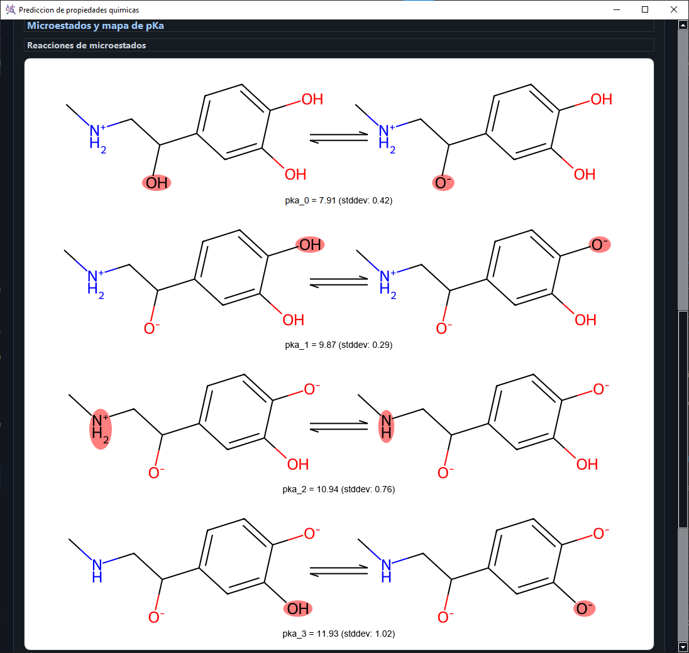

# Molecular Property Predictor

Desktop application for molecular property prediction using machine learning, deep learning, and cheminformatics.

The application predicts molecular log P and microstate pKa values from SMILES, InChI, or structures drawn directly in the integrated molecular editor. The goal of the project is to provide a local inference tool that combines neural network models, molecular graph representations, chemical preprocessing, and visual interpretation of prediction results.

## Overview

This project was developed as an end-to-end molecular property prediction workflow. It includes the desktop interface, molecular input handling, trained model loading, neural network inference, pKa microstate evaluation, and visualization of molecular results.

The app is designed to work locally: molecular structures are processed on the user's machine and predictions are generated without relying on external prediction APIs.

## Downloads

Prebuilt desktop versions are available in the [Releases](https://github.com/maxmodapp/molecular-property-predictor/releases) section.

- Windows x86_64 portable build.
- Linux x86_64 Ubuntu build.

## Screenshots

### Initial Application View



Initial interface before entering or drawing a molecule.

### Molecular Drawing And Prediction



Example workflow using glycine. The molecule can be drawn directly in the editor or entered as SMILES/InChI, then processed by the prediction pipeline.

### Microstate pKa Visualization



pKa prediction output for glycine, including protonation/deprotonation transitions and predicted pKa values.

### Multiple Ionizable Sites



Example prediction for a molecule with multiple ionizable sites, showing the microstate-level pKa analysis and visual output.

## Main Features

- Molecular input through SMILES, InChI, or an embedded structure editor.
- RDKit-based molecule parsing, conversion, standardization, and rendering.
- log P prediction using a trained Keras neural network.
- pKa prediction using graph neural network models over molecular microstates.
- Microstate-level protonation/deprotonation analysis.
- Ensemble-based prediction aggregation and pKa range reporting.
- Visual pKa reaction maps and final molecular pKa map.
- Responsive PySide6 desktop interface with background prediction workers.
- Local inference workflow suitable for desktop use and executable packaging.

## Machine Learning Pipeline

### pKa Model

The pKa module is the main molecular microstate prediction workflow in the application. Starting from the input molecule, the program identifies ionizable sites and generates the possible protonated/deprotonated microstate transitions. Each transition is converted into a molecular graph representation using atom and bond descriptors, then evaluated with fine-tuned graph neural network checkpoints.

The workflow can be summarized as:

1. Parse the input molecule from SMILES, InChI, or the molecular editor.
2. Detect candidate ionizable sites.
3. Generate protonated and deprotonated molecular microstates.
4. Build graph-based molecular inputs for each microstate transition.
5. Run neural network inference for every generated transition.
6. Aggregate the model outputs into a predicted pKa value and prediction range.
7. Display the results as text, reaction visualizations, and a final molecular pKa map.

The model output is presented as:

- Protonated and deprotonated SMILES.
- Predicted pKa value for each microstate transition.
- Prediction range derived from model variation.
- Reaction visualization for each microstate.
- Final pKa map over the molecule.

This allows the application to analyze molecules with one or multiple ionizable sites and report the pKa behavior of each relevant microstate transition.

### log P Model

The log P module uses a trained neural network built with Keras. Molecular inputs are transformed into the representation expected by the model, predictions are generated locally, and the output is converted back to the original log P scale using the normalization parameters saved during training.

This part of the project focuses on integrating a supervised regression model into the same desktop prediction workflow.

## Technical Focus

This project demonstrates:

- Applied machine learning for molecular property prediction.
- Deep learning inference with trained neural network models.
- Graph neural network usage for molecular structures.
- Molecular graph featurization with atom and bond descriptors.
- Integration of cheminformatics tools with neural prediction models.
- Model inference orchestration inside a desktop application.
- Scientific result visualization for chemical interpretation.
- Desktop software packaging and local deployment.

## Datasets

The repository includes processed CSV datasets prepared for model training and inspection, together with external SDF reference datasets preserved with their original license.

## Repository Structure

```text
molecular-property-predictor/
|-- app/
|   |-- desktop_app_final.py
|   |-- pka_prediction_engine.py
|   |-- desktop_app_final.spec
|   |-- build_exe.ps1
|   |-- jsme_editor_embed_fixed.html
|   |-- app_icon.ico
|   `-- app_icon.png
|-- models/
|   |-- logp/
|   |   |-- model_logp.keras
|   |   `-- logp_norm.npz
|   `-- pka/
|       |-- fine_tuned_model_0.pt
|       |-- ...
|       |-- fine_tuned_model_10.pt
|       `-- fine_tuned_best_model.pt
|-- external/
|   `-- pkasolver/
|-- docs/
|   `-- screenshots/
|-- Datasets/
|-- requirements.txt
|-- environment.yml
|-- THIRD_PARTY_NOTICES.md
|-- LICENSE
`-- README.md
```

## Technologies

- Python
- PySide6
- RDKit
- TensorFlow / Keras
- PyTorch
- PyTorch Geometric
- CairoSVG
- SVGUtils
- PyInstaller

## Third-Party Components

The pKa workflow uses selected runtime components from pKaSolver and Dimorphite-DL for microstate handling and pKa-related utilities. The application-level integration, model organization, user interface, prediction presentation, and local inference workflow are implemented in this project.

License and attribution notes are included in `THIRD_PARTY_NOTICES.md`.

## Project Status

The current version supports local prediction of log P and microstate pKa values. The structure is prepared for future expansion to additional molecular properties and additional trained models.
